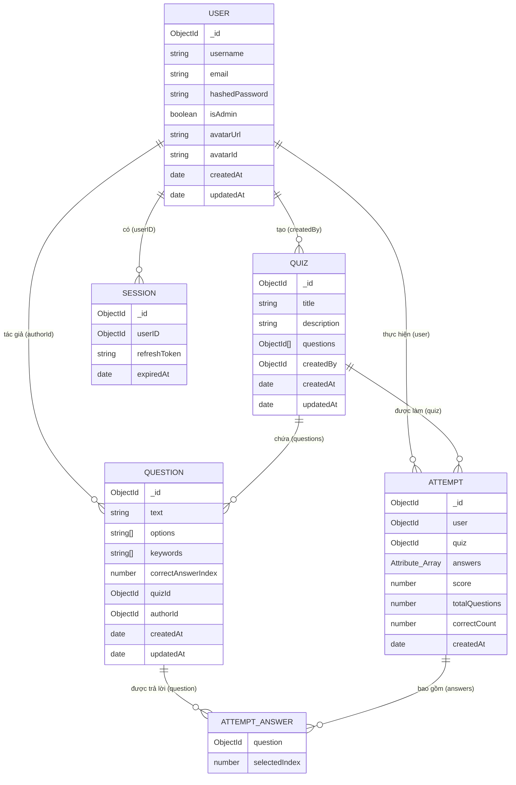

# Sơ đồ thực thể liên kết (ERD) - SimpleQuiz

Dưới đây là sơ đồ ERD của hệ thống SimpleQuiz được vẽ bằng **Mermaid**, dựa trên các Mongoose Schema hiện tại trong thư mục `src/models`.

## Mô tả các mối quan hệ:

1.  **User & Quiz:** Một Admin (`User`) có thể tạo nhiều `Quiz`. Một `Quiz` thuộc về một người tạo duy nhất.
2.  **User & Question:** Một người dùng có thể là tác giả của nhiều `Question`.
3.  **User & Attempt:** Một người dùng có thể thực hiện nhiều lượt làm bài (`Attempt`).
4.  **Quiz & Question:** Một `Quiz` chứa danh sách các câu hỏi. Đồng thời mỗi `Question` cũng lưu `quizId` để biết nó thuộc về bộ đề nào.
5.  **Quiz & Attempt:** Một `Attempt` luôn thuộc về một bộ đề `Quiz` cụ thể.
6.  **Attempt & Question:** Một lượt làm bài (`Attempt`) chứa danh sách các câu trả lời (`answers`), mỗi câu trả lời liên kết đến một `Question` và lưu lại vị trí đáp án người dùng chọn (`selectedIndex`).
7.  **User & Session:** Hệ thống quản lý phiên đăng nhập và Refresh Token thông qua bảng `Session`.
